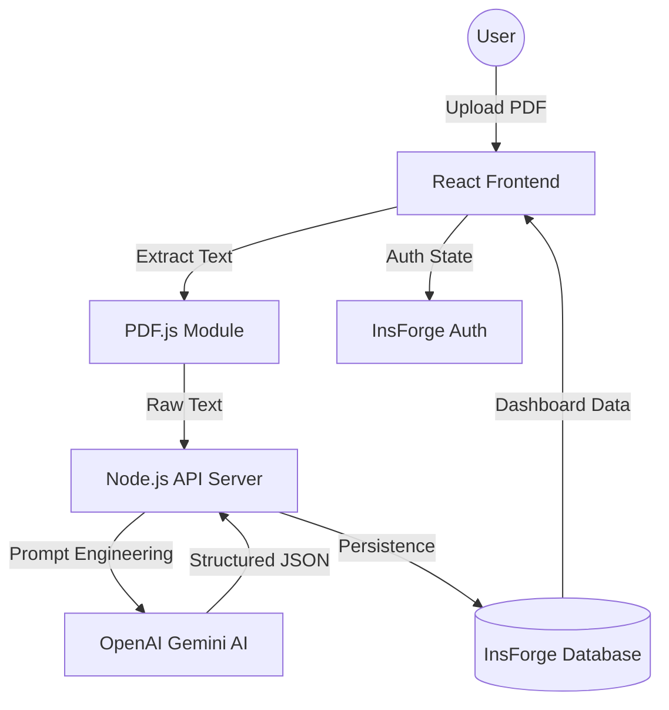

<div align="center">


# 🎓 Vidyalaya AI

### _The Next-Generation AI Study Companion_

[](https://react.dev/)
[](https://www.typescriptlang.org/)
[](https://vitejs.dev/)
[](https://nodejs.org/)
[](https://tailwindcss.com/)
[](LICENSE)

**Vidyalaya** (విద్యాలయ) — _Sanskrit for "House of Knowledge"_

An enterprise-grade AI study platform that converts static educational content into interactive mastery tools including structured summaries, adaptive quizzes, and priority-based study roadmaps.

[🚀 Explore Platform](#) &nbsp;|&nbsp; [📂 Documentation](#) &nbsp;|&nbsp; [🤝 Contributing](#) &nbsp;|&nbsp; [⭐ Support Us](../../stargazers)

</div>

---

## 🏆 Achievement & Recognition

> ### 🥉 We are proud to announce that this project secured 3rd Prize — Team Varanasi
>
> **"Developed with engineering excellence by Team Varanasi, Vidyalaya was awarded 3rd Prize at a major hackathon, outperforming 50+ innovative projects."**
>
> _Recognized for its high-fidelity UI/UX, robust AI pipeline, and immediate real-world utility in the EdTech sector._

---

## 📋 Table of Contents

- [📌 Project Overview](#-project-overview)
- [🏗️ System Architecture](#️-system-architecture)
- [⚙️ Development Methodology](#️-development-methodology)
- [🔄 Application Workflow](#-application-workflow)
- [✨ Key Features](#-key-features)
- [🛠️ Tech Stack](#️-tech-stack)
- [📊 Engineering Decisions](#-engineering-decisions)
- [🧪 Testing & Validation](#-testing--validation)
- [📂 Folder Structure](#-folder-structure)
- [🚀 Future Roadmap](#-future-roadmap)
- [👥 Team](#-team)

---

## 📌 Project Overview

### Problem Statement

Traditional studying involves hours of passive reading, leading to poor retention and information overload. Students often struggle to identify key concepts or create structured schedules under exam pressure.

### The Solution

Vidyalaya bridges the gap between raw information and true understanding. By leveraging **Gemini AI**, the platform transforms any PDF into a multi-dimensional learning experience.

### Real-World Impact

- **Time Efficiency**: Reduces summarization time by 90%.
- **Active Learning**: Encourages testing over passive reading.
- **Accessibility**: Makes complex material digestible for all learning styles.

---

## 🏗️ System Architecture

Vidyalaya utilizes a modern, decoupled **Client-Server Architecture** optimized for high performance and AI processing.



### Module Breakdown

- **Frontend Core**: A high-fidelity React application using **Vite** for sub-second hot reloads and **Framer Motion** for premium interactions.
- **AI Orchestrator**: A Node.js backend that acts as a middleware between the client and Large Language Models, ensuring prompt security and response validation.
- **BaaS Layer**: Powered by **InsForge**, providing real-time database capabilities and session-based authentication.

---

## ⚙️ Development Methodology

The project was executed using **Agile SCRUM**, ensuring rapid iterations and high-quality deliverables.

### 🏃 Sprint Lifecycle

1.  **Sprint Planning**: Defined user stories and prioritized features based on ROI.
2.  **Iterative Development**: 2-week cycles focusing on "Definition of Done."
3.  **Feedback Loops**: Continuous UI/UX testing leading to optimizations like mobile scroll throttling.
4.  **Audit & Refinement**: Final polish for recruiter-ready production quality.

---

## 🔄 Application Workflow

### 1. Authentication Journey

Users sign up through a secure, session-based flow. The **InsForge SDK** handles encrypted credentials and persistent sessions.

### 2. The Analysis Pipeline

- **Upload**: User drops a PDF (up to 10MB).
- **Digitization**: Client-side `pdfjs-dist` extracts text, reducing server load.
- **Synthesis**: AI generates a **Key Takeaway** summary and identifies **Main Concepts**.

### 3. Interactive Mastery

- **Quiz**: AI generates customized questions. Users receive instant feedback.
- **Roadmap**: A priority-based study plan is generated, allowing users to track completion with interactive toggles.

---

## ✨ Key Features

### 📄 Intelligent PDF Synthesis

Proprietary prompt engineering extracts core themes, removing academic filler to provide high-density summaries.

### 🧠 Topic Mastery Quiz

Auto-generated MCQ quizzes that adapt to the document's complexity, forcing active recall.

### 📅 Priority Study Roadmap

Not just a schedule, but a strategy. Each task is assigned a **High/Medium/Low priority**, helping students manage their "Neural Budget" effectively.

### 📱 Responsive "Premium Brutalist" UI

A unique design language featuring:

- **Grain Textures**: For a premium tactile feel.
- **Conditional Effects**: High-quality blurs that automatically disable on mobile to preserve 60FPS performance.

---

## 🛠️ Tech Stack

### 💻 Frontend

- **React 18 & TypeScript**: Robust, type-safe UI logic.
- **Tailwind CSS**: Custom utility-first styling with high-contrast coral accents.
- **Framer Motion**: Orchestrated animations and entrance effects.
- **Lucide Icons**: Consistent, professional iconography.

### ⚙️ Backend & AI

- **Node.js/Express**: Scalable server environment.
- **OpenAI (Gemini 2.0 Flash)**: State-of-the-art LLM for sub-second analysis.
- **InsForge SDK**: Managed database and auth services.

---

## 📊 Engineering Decisions

### Why Gemini 2.0 Flash?

Chosen for its industry-leading speed-to-accuracy ratio, essential for a responsive student experience.

### Performance Optimization

- **Scroll Throttling**: Implemented custom `requestAnimationFrame` hooks to prevent layout thrashing on mobile.
- **Client-Side Extraction**: PDF text extraction happens on the browser, reducing API latency and server costs.
- **Zero-Placeholder Policy**: All demo data is generated via AI to ensure a realistic user experience.

### Security

- **Rate Limiting**: Backend protection against API abuse.
- **Secure Headers**: Implementation of CORS and Helmet for cross-site security.

---

## 🧪 Testing & Validation

- **Cross-Browser Compatibility**: Verified on Chrome, Safari, and Firefox.
- **Mobile Fidelity**: Specific audits for touch targets and animation performance on iOS/Android.
- **Input Validation**: Robust client-side and server-side checks for file types and user inputs.

---

## 📂 Folder Structure

```
vidyalaya/
├── frontend/              # React Client
│   ├── src/
│   │   ├── components/    # Atomic UI components
│   │   ├── pages/         # View logic (Dashboard, Index, Auth)
│   │   ├── lib/           # Service layers & AI integration
│   │   └── hooks/         # Custom performance hooks
├── backend/               # Node.js Server
│   ├── index.js           # API Entry & AI Routes
│   └── lib/               # Database utilities
└── README.md              # Project Documentation
```

---

## 🚀 Future Roadmap

- [ ] **v1.4**: Conversational AI (Chat with your PDF).
- [ ] **v1.5**: Collaborative "Study Circles" for peer learning.
- [ ] **v2.0**: Native Mobile Application for offline study.

---

## 👥 Team

Vidyalaya is a collaborative engineering effort by **Team Varanasi**.

| Member                   | Role                              |
| :----------------------- | :-------------------------------- |
| **P. Durga Vara Prasad** | Frontend Architecture, UI/UX & DB Design |
| **T. Revanth Sai**       |  State Management          |
| **R. Jayaveer**          | AI Pipeline & API Logic           |
| **S. Girish**            | Auth & Backend Security           |

---

<div align="center">

### Built for the future of education.

⭐ **Star this repository to support the project!** ⭐

[🔝 Back to Top](#-vidyalaya-ai)

</div>
